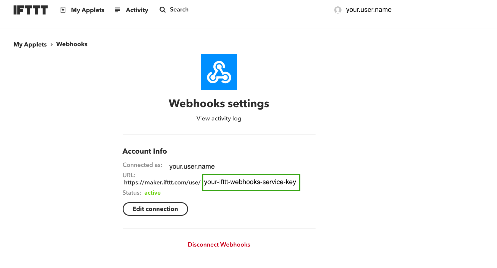

# TheThingsNetwork to IFTTT connector

This app will be listening for requests from TheThingsNetwork and send a request to IFTTT after parse the data.

## Why?

Neither TheThingsNetwork nor IFTTT are able to convert the digital values from Arduino to a human language

## Configuration

Please replace the value of `iftttKey` in `config.json` with the key which you'll find in your IFTTT WebHook Service



## RUN

In order to run the project you just need node.js and yarn. In the command line:

```bash
yarn
yarn start
```

## Want to help?

Feel free to clone the project and create a new branch where you will add your changes.
Once finished you'll need to create a Pull Request with you changes in order to merge it into master.

### TODOS

app.js [40] => When requesting to ifttt we should do something about the answer, especially if there's an error.

app.js [42] => We should add a logger instead of use the console.log
